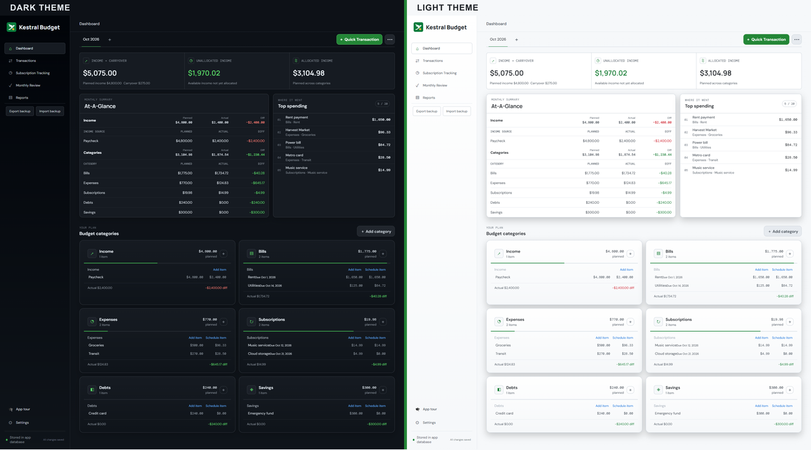
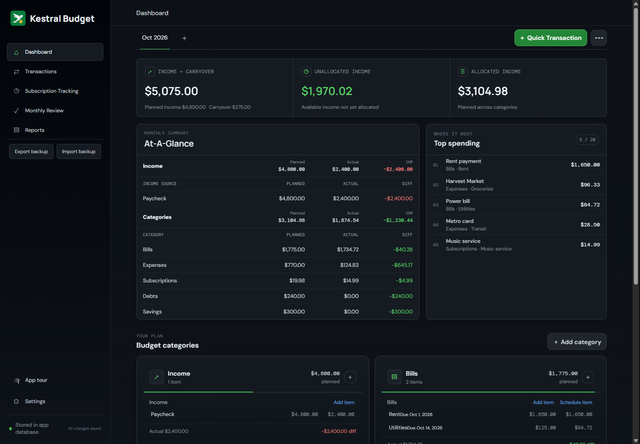
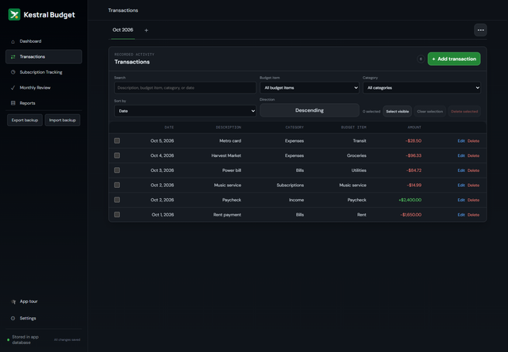
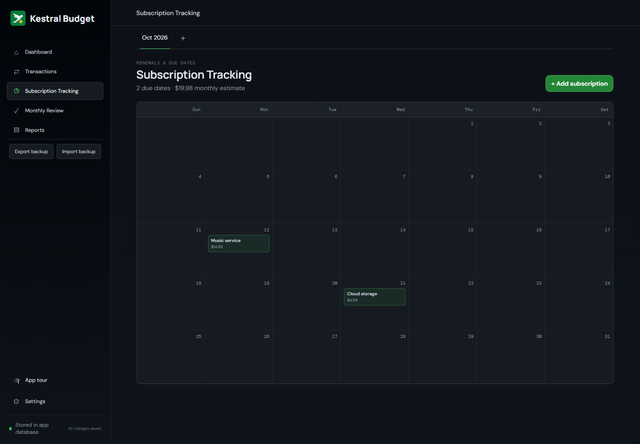
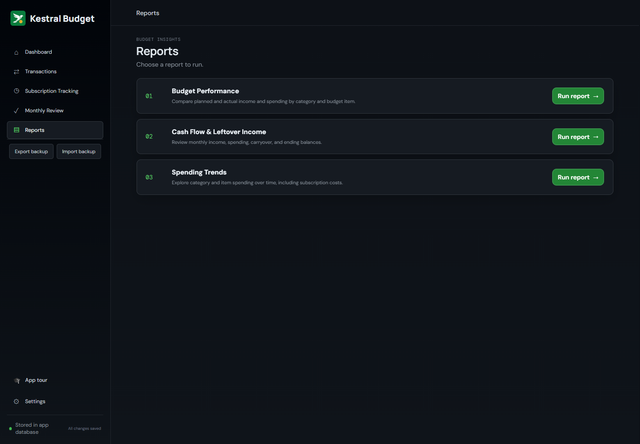

<p align="center">
  
</p>

<h1 align="center">Kestral Budget</h1>

<p align="center">
  <strong>A clear, calm plan for your money—month by month.</strong><br>
  Fast and lightweight, with local-first budgeting and no bank connections or cloud accounts.
</p>

<p align="center">
  <a href="https://github.com/btmcbride/kestralbudget/releases/latest">Download</a>
  · <a href="#budgeting-that-works-your-way">Features</a>
  · <a href="#why-kestral-budget">Why Kestral?</a>
  · <a href="#self-host">Self-host</a>
</p>

<p align="center">
  
  
  
  
</p>

Kestral Budget brings your monthly plan and actual spending together. Plan income, bills, savings, and everyday expenses; record transactions against your budget items; then see how real activity compares with your plan. At a glance, understand what’s allocated, what’s still available, and what can carry forward.

**Make it your budget.** Add as many categories and budget items as you need, choose the sections you use, and personalize your currency, date format, theme, and layout. Run it as a standalone desktop app or self-host it. There are no subscription fees or feature paywalls.

<p align="center">
<a href='https://ko-fi.com/mythicalbeard' target='_blank'></a>
</p>

## Budgeting that works your way

- **Plan and adjust:** Set monthly targets, compare planned with actual income and spending, see unallocated income, and carry a balance forward when you choose.
- **Shape your setup:** Organize your budget with the categories, sections, and items that make sense to you. Choose your currency, date format, theme, and layout.
- **Track the details:** Log transactions against budget items, then search, filter, sort, and manage activity in bulk.
- **Keep due dates visible:** Add due dates to bills, subscriptions, and debts, and see upcoming subscriptions on a calendar.
- **Learn from the numbers:** Use Budget Performance, Cash Flow & Leftover Income, and Spending Trends reports to explore your budget over time.

## Why Kestral Budget?

Kestral is built around flexibility and ownership:

- **Your budget, your rules:** Create as many categories and budget items as you need, and choose the sections that fit your life.
- **Your choice of where it runs:** Use the standalone desktop app or host it on your own computer or server.
- **No subscription wall:** There are no subscription fees or paid feature tiers.

## Who is it for?

Kestral is for people who want a hands-on monthly budget, prefer to enter and categorize transactions themselves, and want to organize their budget their own way. It may not be the right fit if you need automatic bank connections, cloud sync, or automatic backups.

## Screenshots

Screenshots use fictional sample data. Select a preview to open its full-size image.

### Dark and light themes

[](docs/screenshots/themes.png)

| Dashboard | Transactions |
| :---: | :---: |
| [](docs/screenshots/dashboard.png) | [](docs/screenshots/transactions.png) |

| Subscription tracking | Reports |
| :---: | :---: |
| [](docs/screenshots/subscriptions.png) | [](docs/screenshots/reports.png) |

## Install or self-host

| Edition | Get started | Platform |
| --- | --- | --- |
| Standalone desktop app | [Download the latest release](https://github.com/btmcbride/kestralbudget/releases/latest) | Windows x64 or macOS Apple Silicon |
| Self-hosted app | [Docker, Portainer, or Podman instructions](#self-host) | Your own computer or server |

The desktop and self-hosted editions use separate databases. Export and import a backup to move data between them. Backups are manual; do not expose a self-hosted instance to an untrusted network.

### macOS (Apple Silicon)

Download the Apple Silicon `.dmg` from the [latest release](https://github.com/btmcbride/kestralbudget/releases/latest), open it, and drag Kestral Budget into Applications. The current Mac app is not signed or notarized, so Gatekeeper may block its first launch.

After trying to open the app, go to **Apple menu → System Settings → Privacy & Security** and select **Open Anyway** for Kestral Budget, then confirm. Only do this if you downloaded the app from the official release page and trust it. See [Apple’s instructions for safely opening an app](https://support.apple.com/en-us/102445).

## Self-host

All self-hosted options use the same app and keep data in a persistent volume on your machine or server.

### Docker

Install [Docker Desktop](https://docs.docker.com/get-started/get-docker/) or Docker Engine with the Compose plugin, and make sure Git is available. From a terminal:

```sh
git clone https://github.com/btmcbride/kestralbudget.git
cd kestralbudget
docker compose up --build -d
```

Open `http://localhost:8080`. Data is stored in the persistent `kestralbudget-data` volume. Stop the app with `docker compose down`; this keeps your data. Avoid `docker compose down -v` unless you intend to delete it.

### Portainer

Portainer’s Git-based stack deployment does not build this repository’s Docker image automatically ([Portainer details](https://docs.portainer.io/portainer-documentation/2.39-lts/faqs/troubleshooting/stacks-deployments-and-updates/can-i-build-an-image-while-deploying-a-stack-application-from-git)). Build the image on the same Docker host that Portainer manages:

```sh
git clone https://github.com/btmcbride/kestralbudget.git
cd kestralbudget
docker build -f DockerFile -t kestralbudget:local .
```

In Portainer, select that Docker environment, open **Stacks → Add stack → Web editor**, and use this Compose definition:

```yaml
services:
  kestralbudget:
    image: kestralbudget:local
    ports:
      - "8080:8080"
    environment:
      HOST: "0.0.0.0"
      PORT: "8080"
      DATABASE_PATH: /data/kestralbudget.sqlite
    volumes:
      - kestralbudget-data:/data
    restart: unless-stopped

volumes:
  kestralbudget-data:
```

Deploy the stack and open `http://localhost:8080`. The database is kept in the named volume.

### Podman Desktop

Install [Podman Desktop](https://podman-desktop.io/) and start its Podman machine. In Podman Desktop, go to **Settings → Resources → Compose → Setup** to install the Compose provider ([Podman Compose setup](https://podman-desktop.io/docs/compose/setting-up-compose)). Then clone the repository and start the app:

```sh
git clone https://github.com/btmcbride/kestralbudget.git
cd kestralbudget
podman compose up --build -d
```

Open `http://localhost:8080`. Stop it with `podman compose down`; the named volume preserves your data.

## Data and privacy

Kestral Budget has no accounts, bank connections, cloud sync, or automatic backups. The desktop app stores data on your computer; the self-hosted edition stores it in its configured database volume. Keep independent backups of important data.
